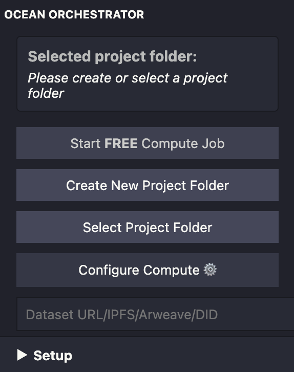

# Ocean Orchestrator

Run affordable GPU AI jobs from your editor with a one-click workflow and pay-per-use mechanism.

Ocean Orchestrator lets you submit a containerized compute job to remote nodes, monitor it, and automatically pull the results back. It uses Ocean Compute-to-Data (C2D), meaning the job runs in an isolated container near the data and only the outputs are returned. This gives you a low-friction way to run batch jobs without spinning up or managing servers.

Ocean Network coordinates those remote runs across a distributed set of GPU nodes, handling orchestration behind the scenes so pay-per-use compute jobs stay usable even as more nodes and workloads join.

Works in VS Code, Cursor, Antigravity, and Windsurf.

> If you use Cursor, Antigravity, or Windsurf, install Ocean Orchestrator the same way you install VS Code extensions in your editor, or use the [Open VSX](https://open-vsx.org/) listing if your editor does not support the VS Code Marketplace.



## Features

### One-Click Job Runs

Run a job without spinning up servers. Create a project, press **Start Compute Job**, and receive the outputs in your folder. Supports Python and JavaScript projects with built-in templates and dependencies.

### Pay Per Use Compute

Start with free compute for quick tests, then switch to paid compute jobs when you need more resources.

### Privacy-Preserving With Compute-to-Data

Your code runs in an isolated container, and only results are returned, so data stays sealed.

### Remote AI Compute

Run embeddings, inference, data cleanup, batch processing, and other containerized workloads without provisioning servers.

### Real Time Monitoring

Track job status and view logs directly in your editor via the Output console.

### Automatic Results Retrieval

Outputs and logs are saved to your results folder as soon as the job completes.

## Getting Started

1. Install Ocean Orchestrator from your favorite extension marketplace in the extensions tab of your IDE. We currently support VS Code, Cursor, Antigravity, and Windsurf.
2. Open the Ocean Orchestrator panel from the activity bar
3. Create a new project folder:
   - Choose a parent directory for your project
   - Name your project (default: `new-compute-job`)
   - Select your language: Python, JavaScript, or your custom container
4. Explore your project structure:
   - Algorithm file (`.py` or `.js`)
   - Dockerfile with environment setup
   - Dependencies file (`requirements.txt` or `package.json`)
   - `.env` secrets file
5. Click **Start FREE Compute Job**
6. Monitor job status and logs in the Output console
7. Check results and logs in your project's `results` folder

### Extension Layout

Ocean Orchestrator adds a dedicated Ocean section to the activity bar. From there, you can:

- Optionally select a dataset file
- Create a new compute project or select an existing one
- View available compute resources under Setup
- Configure compute settings under Configure Compute
- Start free or paid compute jobs

### Starting a Compute Job

1. Create a new project folder or select an existing one
2. Review your algorithm, Dockerfile, and dependencies
3. Click **Start Free Compute Job** or switch to paid for more resources
4. Monitor job status and real-time logs in the Output console
5. Check outputs in `results` and `logs`

## Advanced Setup

### Custom Docker Image

Use your own docker image if you are not using a Dockerfile in the project folder.

### Compute Resources

Free compute uses minimal resources for testing. See available tiers under Setup.

### Paid Compute

Paid compute jobs run on demand and charge per run based on resources, time, and environment selection.

### Node Status Check

Use **Check** under Setup to verify node availability before running a job.

## Troubleshooting

- **Job cannot start** — Check the node status under Setup, then press Check.
- **Not enough funds** — Switch to free compute or top up your account.
- **General issues** — Check logs in the Output console. Logs are also saved in your project folder under `logs`.

## Development and Contributing

Contributions are welcome. Please check the repository guidelines for local development and PRs.

### Prerequisites

- Node.js (version specified in `.nvmrc`)
- VSCode version 1.93.0 or higher
- Git

### Running the Extension Locally

1. Clone the repository:

   ```bash
   git clone https://github.com/your-username/ocean-protocol-vscode
   cd ocean-protocol-vscode
   ```

2. Install dependencies:

   ```bash
   npm install
   ```

3. Build the extension:

   ```bash
   npm run compile
   ```

4. Open in VSCode:
   - Press F5 to start debugging. This will open a new VSCode window with the extension loaded.

### Publishing the Extension

For the CI to publish the extension, you just need to ensure that the version number is bumped in `package.json` on main, and then the rest is automatic via the GitHub CI.
