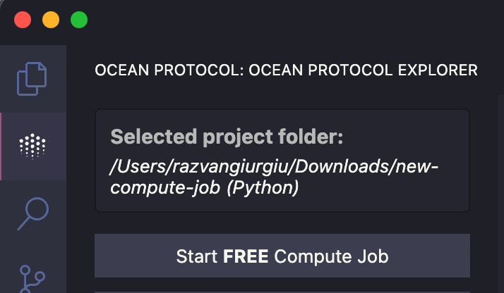

# Ocean Protocol VSCode Extension

Run Compute-to-Data jobs on Ocean Protocol directly from VS Code.

The extension streamlines project creation, job submission, monitoring, and results retrieval.

Create a new project with built-in algorithm templates and dependencies, then click **Start FREE Compute Job**.



## Features

### 🚀 One-Click Compute Jobs

Create new compute projects with automatic Dockerfile and dependencies setup. Choose between Python or JavaScript templates.

### 💰 Free Compute Jobs

Start with free compute jobs, then upgrade to paid compute for more power.

### 📊 Real-Time Monitoring

Track job progress and view algorithm logs directly in VS Code's Output console.

### 📁 Automatic Results Handling

Results and logs are automatically saved in your project folder when your job completes.

## Getting Started

1. Install the extension from the VS Code Marketplace
2. Open the Ocean Protocol panel from the activity bar
3. Create a new project folder:
   - Choose a parent directory for your project
   - Name your project (default: `new-compute-job`)
   - Select your language: Python or JavaScript
4. Explore your project structure:
   - Algorithm file (`.py` or `.js`)
   - Dockerfile with environment setup
   - Dependencies file (`requirements.txt` or `package.json`)
5. Click **Start FREE Compute Job**
6. Monitor job status and logs in the Output console
7. Check results and logs in your project's `results` folder

### Requirements

VS Code 1.96.0 or higher

### Extension Layout

The extension adds a dedicated Ocean Protocol section to the activity bar. Here you can:

- Optionally select a dataset file.
- Create new project folders or select existing ones
- View compute resources under the Setup dropdown
- Configure compute settings (accessible via Configure Compute)
- Start free or paid compute jobs

### Starting a Compute Job

1. Create a new project folder or select an existing one
2. Review your algorithm, Dockerfile, and dependencies
3. Click **Start FREE Compute Job** (or upgrade to paid for more resources)
4. Monitor job status and logs in the Output console
5. Check results in your project folder under `results/`

## Advanced Setup

- **Custom Docker Image/Tag**: Use your own docker image and tag (only if no Dockerfile is provided in your project folder)
- **Auth Token**: Auto-generated when you configure your compute settings
- **Custom Compute Node**: Enter your own node URL or use the default Ocean Protocol node
- **Compute Resources**: Free compute uses minimal resources. View available resources under the Setup dropdown
- **Paid Compute**: Upgrade from free to paid compute for more computational power
- **Node Status Check**: Use the Check button under Setup dropdown to verify node availability


## Troubleshooting

- **Job cannot start** → Check node status (under Setup dropdown, press the Check button)
- **Job not running** → Verify your Node URL in Configure Compute
- **Not enough funds** → Use Configure Compute to adjust your settings or switch to free compute
- **General issues** → Check extension logs in the Output console. Logs are also saved in your project folder under `logs/`

## Development & Contributing

Refer to the project structure and available scripts for local development. Contributions are always welcome—please check our guidelines in the repository.

### Prerequisites

- Node.js (version specified in `.nvmrc`)
- VSCode version 1.93.0 or higher
- Git

### Running the Extension Locally

1. Clone the repository:

   ```bash
   git clone https://github.com/your-username/ocean-protocol-vscode
   cd ocean-protocol-vscode
   ```

2. Install dependencies:

   ```bash
   npm install
   ```

3. Build the extension:

   ```bash
   npm run compile
   ```

4. Open in VSCode:
   - Press F5 to start debugging. This will open a new VSCode window with the extension loaded.

### Publishing the Extension

For the CI to publish the extension, you just need to ensure that the version number is bumped in package.json on main and then the rest is automatic via the GitHub CI.

## License

This project is licensed under the Apache License 2.0. See the [LICENSE](LICENSE) file for details.

## Contact

For bug reports and feature requests, please open an issue in the GitHub repository.

For general questions about Ocean Protocol, join the [Ocean Protocol Discord](https://discord.gg/TnXjkR5).
